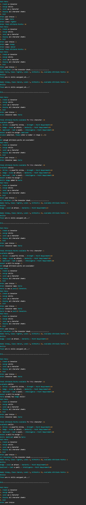

Requirements:

1.) Create a class called Character that has the following properties:

    Name (string) 
    Class (string) 
    Level (int) 
    HitPoints (int) 
    AvailableAttributePoints (int)
    Skills (List<Skill>)

2.) Create a class called Skill that has the following properties:

    Name (string) 
    Description (string) 
    Attribute (string)
    RequiredAttributePoints (int)

3.) Create a C# console application. The Main method declares a list of Character objects to store the characters and a list of Skill objects to store the available skills in the game.

4.) Implement the following features in the console application using control statements, loops, and lists:

    Create a Character: Each character has a Name, Class, Level, HitPoints, AvailableAttributePoints, and a list of Skills. The ToString() method is overridden to display the character’s details and their skills. Calculate the character's starting level (1) and hit points (10 + AvailableAttributePoints/2, use integer division). Add the character to the list of characters.
    Assign skills: Each skill has a Name, Description, Attribute, and RequiredAttributePoints. The ToString method is overridden to display the skill’s details. The user should be able to select a character by name and assign a skill to that character. A character can have multiple skills, but each skill can only be assigned once to a character. A skill can be assigned if the character's AvailableAttributePoints meet the RequiredAttributePoints for that skill. Once a skill is assigned, deduct the RequiredAttributePoints value from the caharacter’s AvailableAttributePoints.
    Level up a character: The user should be able to select a character by name and level up the character. When a character levels up, their level increases by 1, their hit points increase by 5, and they gain 10 additional attribute points.
    Display the character sheet: The user should be able to view the details of all created characters.
    Exit: The user should be able to exit the application

5.) The application should run in a loop, allowing the user to perform multiple operations without restarting the program. The user should be presented with a menu of options to choose from at each iteration.

